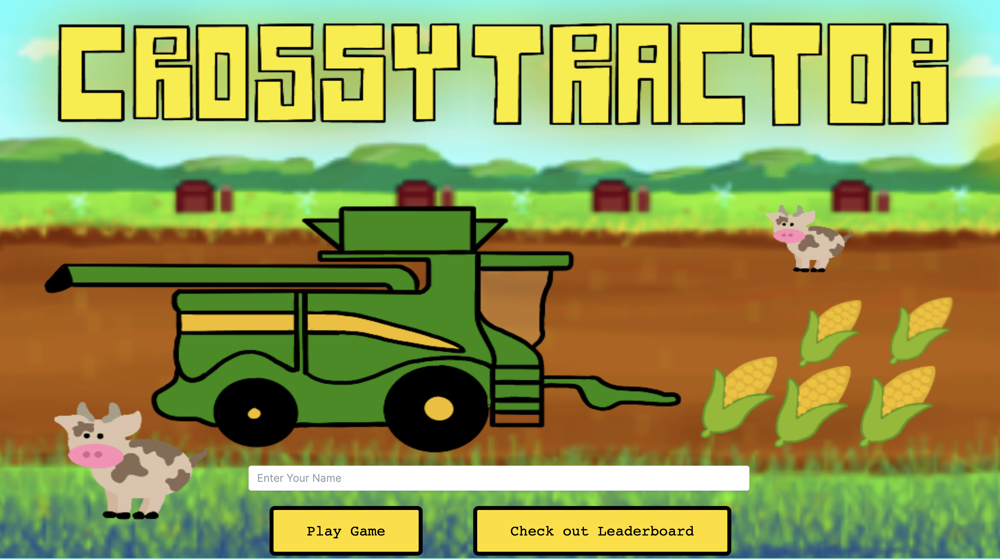
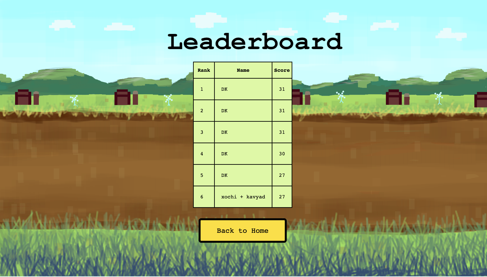
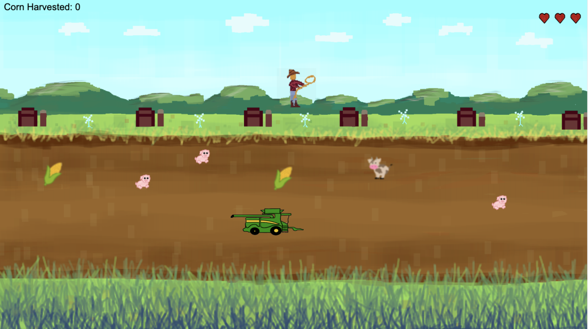

# Welcome to CrossyTractor (Research Park Hackathon 2023 2nd Place Overall Project)!!! :farmer: :cow: :corn: :pig: 

## You can play our game right now  (if the server is running :wink:): https://crossytractor-production.up.railway.app

## And watch our demo video here: https://youtu.be/sGEJH6Rxo4U

## Team Members:

#### :penguin: Ezra Akresh: Singleton Law Firm
#### :orangutan: Amit Krishnaiyer: John Deere
#### :stuck_out_tongue_closed_eyes: Dhruv Kulgod: John Deere
#### :cherry_blossom: Kavya Puranam: John Deere
#### :zany_face: Xochilith Saldaña: John Deere


## Some images of our beautiful game: 








## How to play

So, our game is a one player or two player game! If you are playing with one player, you can control the combine with the "AWSD" keypad:
"A": left
"S": down
"W": up
"D": right

Your goal is simple: collect the corn and avoid running over the pigs and cows with the combine.


With two players, using the left and right arrow, the second player can control the farmer at the top of the map, and if you press the top arrow when the farmer is right above an animal, he'll lasso it away. The farmer and the combine are working together!

## Repository setup
```
git clone https://github.com/Amitten77/CrossyTractor.git
cd frontend
npm i
npm run dev
```

## Our tech stack

Frontend:
- **React** and **Next.js** as a web framework for routing
- **Tailwindcss** for defining styles for web-page
- **Pixi.js** for quick rendering for our 2D graphics
- **Gimp** and **Procreate** for our custom graphics
- **Vercel** for deployment

Backend:
- **Express** for middleware 
- **MongoDB** for storing leaderboard data
- Render.com for deployment

Reference Resources:
- https://chat.openai.com/
- https://stablediffusionweb.com/
- https://www.chipotle.com/order#menu


